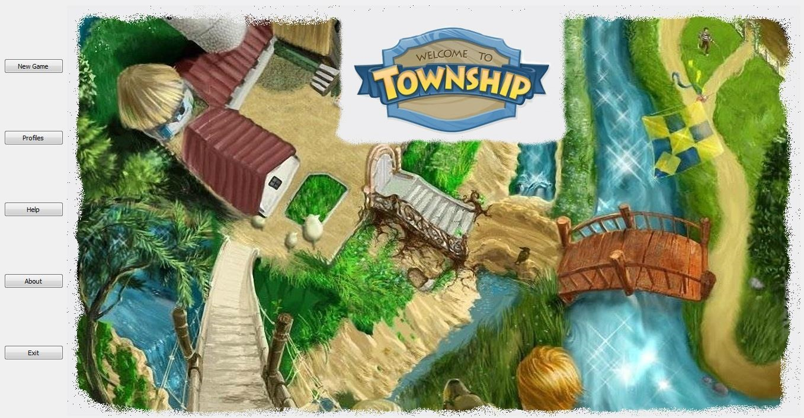
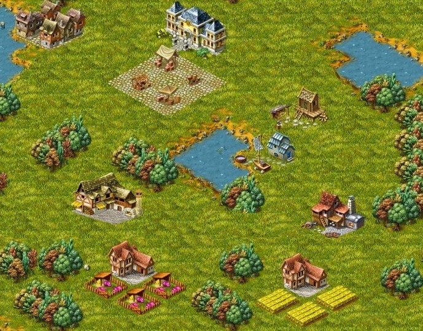
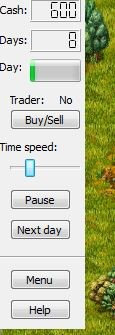
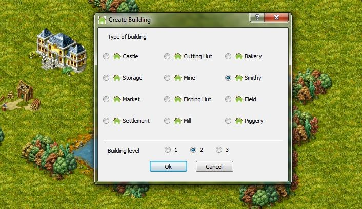
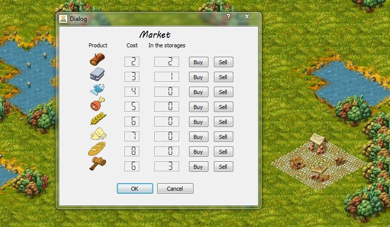
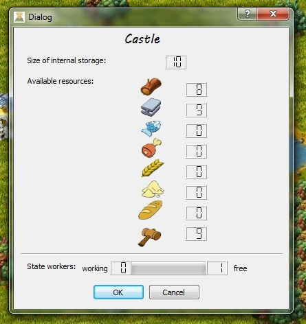
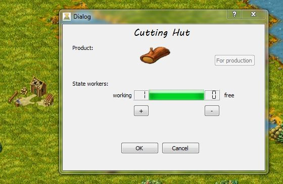
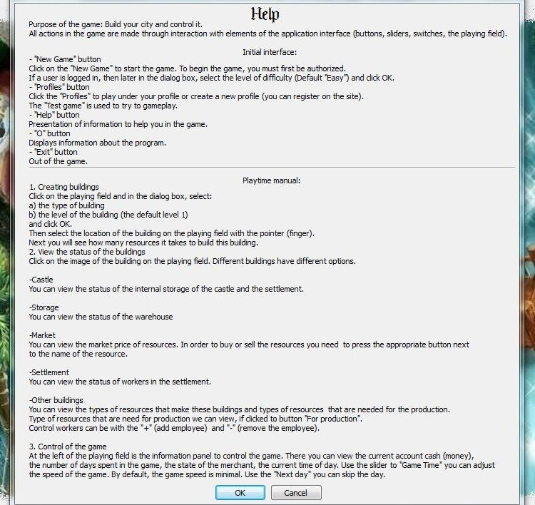
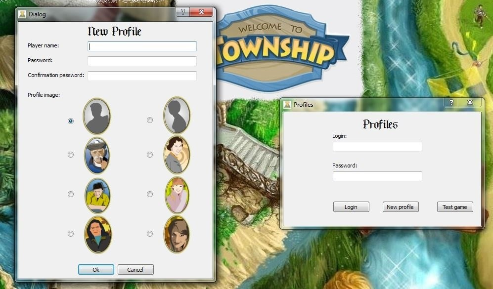
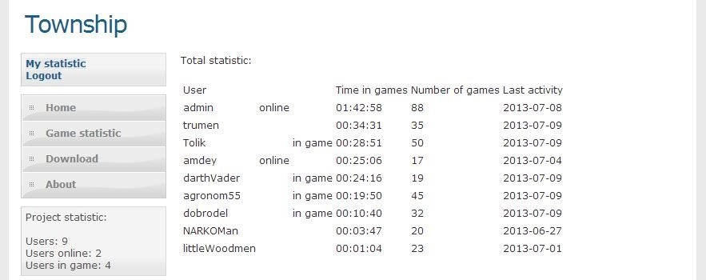

# Township - economic simulator of medieval town
This game is my course work (university course "Object Oriented Programming") and my project in EMC mentoring programm. Purpose of the game: build your town and control it. Game is client and has server side (PHP site) with database for save players. statistic 
Development tools: C++/Qt
## Screenshots

     
    <i>Intro page</i>
     
     
     
    <i>Game window</i>
     
     
     
    <i>Control panel</i>
     
     
     
    <i>Create buildings</i>
     
     
     
    <i>Market: buy/sell products</i>
     
     
     
    <i>Products and workers in Castle</i>
     
     
     
    <i>Cutting Hut menu</i>
     
     
     
    <i>Help window</i>
     
     
     
    <i>Creating profiles, login and testing game</i>
     
     
     
    <i>Players statistic on site</i>

